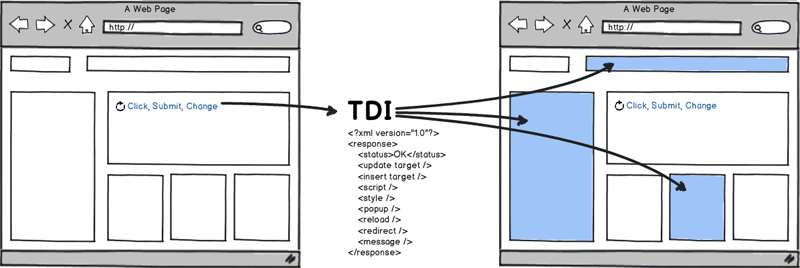

# TDI - Turbocharged DOM Infusion

Twinstone TDI is a JavaScript library which makes all of the "AJAX stuff" for you. With TDI, you will no longer need pieces of application logic replicated in JavaScript. TDI moves all decisions to the server side, because the server has all the relevant data.

* TDI automatically processes user actions (link clicks, form submissions).
* TDI defines a standardized protocol to communicate with a server.
* TDI allows the server to process desired actions and to create a list of instructions to modify the client page.
* TDI automatically executes server instructions and updates the page DOM accordingly.

## Motivation

Historically, web applications were based on a strict request-response paradigm. The client sends actions and possibly some data, the server responds with a whole HTML page reflecting the new state. With so-called Web 2.0, the pages became more dynamic and many user actions are now processed with client-side scripts. Pages are not reloaded as a whole anymore but partial updates to their DOM are made as necessary.

However, the client JavaScript typically needs some server-based data to display them in appropriate places. To fetch such data, additional requests (sometimes called micro-requests) have to be sent to the server. This often increases the client-server communication. Even if all data are wrapped into a single response, it still leads to error-prone JavaScript that is responsible for filling that data to various places.

TDI (Turbocharged DOM Infusion) brings a novel approach which is a sort of compromise between the old plain request-response paradigm and individual micro-requests. With TDI, user actions are still sent to the server in one request. The server performs the action and then it decides what portions of the page should be updated and how. These updates are embedded into one XML response containing fragments of HTML. It is supposed that these fragments are generated by the very same templates as the original page.

As a result, TDI allows you to have just one concise piece of JavaScript at the client side. The rest of your application logic stays with the server where it belongs.

## Documentation

* [Download and Setup](docs/download-and-setup.md)
* [Web page integration](docs/web-page-integration.md)
* [Infusing Protocol](docs/infusing-protocol.md)
* [API Reference](http://twinstone.github.io/tdi/docs/api/)

## Supported browsers

* Internet Explorer 7+
* Firefox*
* Chrome*
* Opera*

* 2 latest major releases
